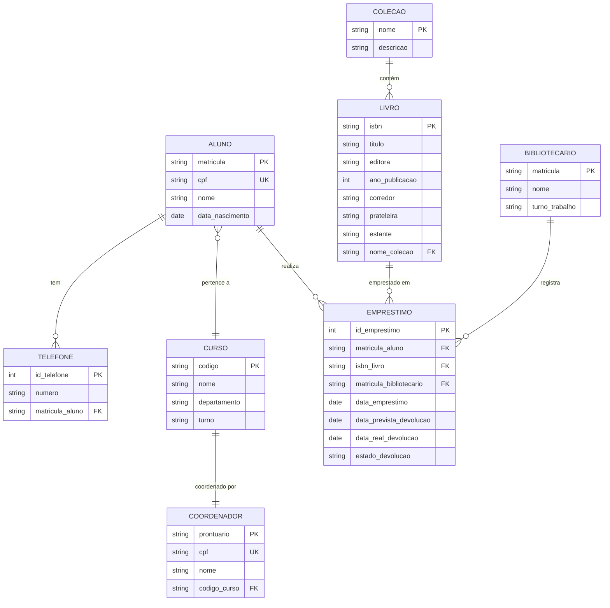

# ARQBDD1 – Banco de Dados: Biblioteca Universitária
**Curso Técnico em Informática – Prof. Mauro de Lucca**

---

## 1. NOTAÇÃO TEXTUAL (Modelo Lógico)

### Entidades e Atributos

```
ALUNO (matricula [PK], cpf [UNIQUE], nome, data_nascimento)
TELEFONE (id_telefone [PK], numero, matricula_aluno [FK → ALUNO])
CURSO (codigo [PK], nome, departamento, turno)
COORDENADOR (prontuario [PK], cpf [UNIQUE], nome, codigo_curso [FK → CURSO, UNIQUE])
LIVRO (isbn [PK], titulo, editora, ano_publicacao, corredor, prateleira, estante,
       nome_colecao [FK → COLECAO, pode ser NULL])
COLECAO (nome [PK], descricao)
BIBLIOTECARIO (matricula [PK], nome, turno_trabalho)
EMPRESTIMO (id_emprestimo [PK], matricula_aluno [FK → ALUNO], isbn_livro [FK → LIVRO],
            matricula_bibliotecario [FK → BIBLIOTECARIO],
            data_emprestimo, data_prevista_devolucao,
            data_real_devolucao [pode ser NULL], estado_devolucao [pode ser NULL])
```

---

### Chaves e Restrições

| Tabela | Chave Primária | Chaves Estrangeiras | Restrições |
|---|---|---|---|
| ALUNO | matricula | — | cpf UNIQUE |
| TELEFONE | id_telefone | matricula_aluno → ALUNO | — |
| CURSO | codigo | — | — |
| COORDENADOR | prontuario | codigo_curso → CURSO | cpf UNIQUE, codigo_curso UNIQUE |
| LIVRO | isbn | nome_colecao → COLECAO | nome_colecao pode ser NULL |
| COLECAO | nome | — | — |
| BIBLIOTECARIO | matricula | — | — |
| EMPRESTIMO | id_emprestimo | matricula_aluno → ALUNO, isbn_livro → LIVRO, matricula_bibliotecario → BIBLIOTECARIO | data_real_devolucao e estado_devolucao podem ser NULL |

---

## 2. DIAGRAMA LÓGICO (Mermaid – para usar no mermaid.live)

Cole o código abaixo em **https://mermaid.live**



---

## 3. DIAGRAMA ENTIDADE-RELACIONAMENTO (draw.io / Lucidchart)

Para o **DER (modelo conceitual)**, use o arquivo XML abaixo no **draw.io (app.diagrams.net)**.

### Como importar no draw.io:
1. Acesse **https://app.diagrams.net**
2. Clique em **Extras → Edit Diagram**
3. Cole o XML abaixo e clique **OK**

```xml
<mxGraphModel>
  <root>
    <mxCell id="0"/>
    <mxCell id="1" parent="0"/>

    <!-- ALUNO -->
    <mxCell id="2" value="ALUNO" style="ellipse;whiteSpace=wrap;html=1;fillColor=#dae8fc;strokeColor=#6c8ebf;fontStyle=1;fontSize=13;" vertex="1" parent="1">
      <mxGeometry x="300" y="60" width="120" height="60" as="geometry"/>
    </mxCell>
    <mxCell id="3" value="matricula (PK)" style="ellipse;whiteSpace=wrap;html=1;fillColor=#fff2cc;strokeColor=#d6b656;fontSize=11;" vertex="1" parent="1">
      <mxGeometry x="160" y="20" width="110" height="40" as="geometry"/>
    </mxCell>
    <mxCell id="4" value="cpf (único)" style="ellipse;whiteSpace=wrap;html=1;fontSize=11;" vertex="1" parent="1">
      <mxGeometry x="280" y="0" width="90" height="40" as="geometry"/>
    </mxCell>
    <mxCell id="5" value="nome" style="ellipse;whiteSpace=wrap;html=1;fontSize=11;" vertex="1" parent="1">
      <mxGeometry x="390" y="0" width="80" height="40" as="geometry"/>
    </mxCell>
    <mxCell id="6" value="data_nascimento" style="ellipse;whiteSpace=wrap;html=1;fontSize=11;" vertex="1" parent="1">
      <mxGeometry x="490" y="20" width="120" height="40" as="geometry"/>
    </mxCell>
    <mxCell id="7" value="(telefones)" style="ellipse;whiteSpace=wrap;html=1;fillColor=#f8cecc;strokeColor=#b85450;fontSize=11;" vertex="1" parent="1">
      <mxGeometry x="230" y="140" width="90" height="40" as="geometry"/>
    </mxCell>

    <!-- Linhas ALUNO - atributos -->
    <mxCell id="10" edge="1" source="2" target="3" parent="1"><mxGeometry relative="1" as="geometry"/></mxCell>
    <mxCell id="11" edge="1" source="2" target="4" parent="1"><mxGeometry relative="1" as="geometry"/></mxCell>
    <mxCell id="12" edge="1" source="2" target="5" parent="1"><mxGeometry relative="1" as="geometry"/></mxCell>
    <mxCell id="13" edge="1" source="2" target="6" parent="1"><mxGeometry relative="1" as="geometry"/></mxCell>
    <mxCell id="14" edge="1" source="2" target="7" parent="1"><mxGeometry relative="1" as="geometry"/></mxCell>

    <!-- CURSO -->
    <mxCell id="20" value="CURSO" style="ellipse;whiteSpace=wrap;html=1;fillColor=#d5e8d4;strokeColor=#82b366;fontStyle=1;fontSize=13;" vertex="1" parent="1">
      <mxGeometry x="300" y="280" width="120" height="60" as="geometry"/>
    </mxCell>
    <mxCell id="21" value="codigo (PK)" style="ellipse;whiteSpace=wrap;html=1;fillColor=#fff2cc;strokeColor=#d6b656;fontSize=11;" vertex="1" parent="1">
      <mxGeometry x="160" y="300" width="100" height="40" as="geometry"/>
    </mxCell>
    <mxCell id="22" value="nome" style="ellipse;whiteSpace=wrap;html=1;fontSize=11;" vertex="1" parent="1">
      <mxGeometry x="280" y="260" width="80" height="35" as="geometry"/>
    </mxCell>
    <mxCell id="23" value="departamento" style="ellipse;whiteSpace=wrap;html=1;fontSize=11;" vertex="1" parent="1">
      <mxGeometry x="390" y="258" width="100" height="35" as="geometry"/>
    </mxCell>
    <mxCell id="24" value="turno" style="ellipse;whiteSpace=wrap;html=1;fontSize=11;" vertex="1" parent="1">
      <mxGeometry x="500" y="275" width="80" height="35" as="geometry"/>
    </mxCell>
    <mxCell id="25" edge="1" source="20" target="21" parent="1"><mxGeometry relative="1" as="geometry"/></mxCell>
    <mxCell id="26" edge="1" source="20" target="22" parent="1"><mxGeometry relative="1" as="geometry"/></mxCell>
    <mxCell id="27" edge="1" source="20" target="23" parent="1"><mxGeometry relative="1" as="geometry"/></mxCell>
    <mxCell id="28" edge="1" source="20" target="24" parent="1"><mxGeometry relative="1" as="geometry"/></mxCell>

    <!-- Relacionamento ALUNO-CURSO -->
    <mxCell id="30" value="pertence" style="rhombus;whiteSpace=wrap;html=1;fillColor=#ffe6cc;strokeColor=#d79b00;fontStyle=1;" vertex="1" parent="1">
      <mxGeometry x="320" y="175" width="80" height="50" as="geometry"/>
    </mxCell>
    <mxCell id="31" value="N" edge="1" source="2" target="30" parent="1"><mxGeometry relative="1" as="geometry"/></mxCell>
    <mxCell id="32" value="1" edge="1" source="30" target="20" parent="1"><mxGeometry relative="1" as="geometry"/></mxCell>

    <!-- COORDENADOR -->
    <mxCell id="40" value="COORDENADOR" style="ellipse;whiteSpace=wrap;html=1;fillColor=#e1d5e7;strokeColor=#9673a6;fontStyle=1;fontSize=13;" vertex="1" parent="1">
      <mxGeometry x="620" y="280" width="140" height="60" as="geometry"/>
    </mxCell>
    <mxCell id="41" value="prontuario (PK)" style="ellipse;whiteSpace=wrap;html=1;fillColor=#fff2cc;strokeColor=#d6b656;fontSize=11;" vertex="1" parent="1">
      <mxGeometry x="700" y="220" width="120" height="40" as="geometry"/>
    </mxCell>
    <mxCell id="42" value="cpf (único)" style="ellipse;whiteSpace=wrap;html=1;fontSize=11;" vertex="1" parent="1">
      <mxGeometry x="770" y="270" width="90" height="35" as="geometry"/>
    </mxCell>
    <mxCell id="43" value="nome" style="ellipse;whiteSpace=wrap;html=1;fontSize=11;" vertex="1" parent="1">
      <mxGeometry x="780" y="315" width="80" height="35" as="geometry"/>
    </mxCell>
    <mxCell id="44" edge="1" source="40" target="41" parent="1"><mxGeometry relative="1" as="geometry"/></mxCell>
    <mxCell id="45" edge="1" source="40" target="42" parent="1"><mxGeometry relative="1" as="geometry"/></mxCell>
    <mxCell id="46" edge="1" source="40" target="43" parent="1"><mxGeometry relative="1" as="geometry"/></mxCell>

    <!-- Relacionamento CURSO-COORDENADOR -->
    <mxCell id="50" value="coordena" style="rhombus;whiteSpace=wrap;html=1;fillColor=#ffe6cc;strokeColor=#d79b00;fontStyle=1;" vertex="1" parent="1">
      <mxGeometry x="520" y="288" width="80" height="50" as="geometry"/>
    </mxCell>
    <mxCell id="51" value="1" edge="1" source="20" target="50" parent="1"><mxGeometry relative="1" as="geometry"/></mxCell>
    <mxCell id="52" value="1" edge="1" source="50" target="40" parent="1"><mxGeometry relative="1" as="geometry"/></mxCell>

    <!-- LIVRO -->
    <mxCell id="60" value="LIVRO" style="ellipse;whiteSpace=wrap;html=1;fillColor=#f0a30a;fontColor=#000000;strokeColor=#BD7000;fontStyle=1;fontSize=13;" vertex="1" parent="1">
      <mxGeometry x="300" y="530" width="120" height="60" as="geometry"/>
    </mxCell>
    <mxCell id="61" value="isbn (PK)" style="ellipse;whiteSpace=wrap;html=1;fillColor=#fff2cc;strokeColor=#d6b656;fontSize=11;" vertex="1" parent="1">
      <mxGeometry x="130" y="540" width="90" height="35" as="geometry"/>
    </mxCell>
    <mxCell id="62" value="titulo" style="ellipse;whiteSpace=wrap;html=1;fontSize=11;" vertex="1" parent="1">
      <mxGeometry x="200" y="490" width="80" height="35" as="geometry"/>
    </mxCell>
    <mxCell id="63" value="editora" style="ellipse;whiteSpace=wrap;html=1;fontSize=11;" vertex="1" parent="1">
      <mxGeometry x="300" y="475" width="80" height="35" as="geometry"/>
    </mxCell>
    <mxCell id="64" value="ano_publicacao" style="ellipse;whiteSpace=wrap;html=1;fontSize=11;" vertex="1" parent="1">
      <mxGeometry x="400" y="476" width="110" height="35" as="geometry"/>
    </mxCell>
    <mxCell id="65" value="(corredor, prateleira, estante)" style="ellipse;whiteSpace=wrap;html=1;fillColor=#f8cecc;strokeColor=#b85450;fontSize=11;" vertex="1" parent="1">
      <mxGeometry x="500" y="530" width="150" height="40" as="geometry"/>
    </mxCell>
    <mxCell id="66" edge="1" source="60" target="61" parent="1"><mxGeometry relative="1" as="geometry"/></mxCell>
    <mxCell id="67" edge="1" source="60" target="62" parent="1"><mxGeometry relative="1" as="geometry"/></mxCell>
    <mxCell id="68" edge="1" source="60" target="63" parent="1"><mxGeometry relative="1" as="geometry"/></mxCell>
    <mxCell id="69" edge="1" source="60" target="64" parent="1"><mxGeometry relative="1" as="geometry"/></mxCell>
    <mxCell id="70" edge="1" source="60" target="65" parent="1"><mxGeometry relative="1" as="geometry"/></mxCell>

    <!-- COLECAO -->
    <mxCell id="80" value="COLECAO" style="ellipse;whiteSpace=wrap;html=1;fillColor=#f8cecc;strokeColor=#b85450;fontStyle=1;fontSize=13;" vertex="1" parent="1">
      <mxGeometry x="620" y="530" width="120" height="60" as="geometry"/>
    </mxCell>
    <mxCell id="81" value="nome (PK, único)" style="ellipse;whiteSpace=wrap;html=1;fillColor=#fff2cc;strokeColor=#d6b656;fontSize=11;" vertex="1" parent="1">
      <mxGeometry x="720" y="480" width="120" height="40" as="geometry"/>
    </mxCell>
    <mxCell id="82" value="descricao" style="ellipse;whiteSpace=wrap;html=1;fontSize=11;" vertex="1" parent="1">
      <mxGeometry x="760" y="540" width="90" height="35" as="geometry"/>
    </mxCell>
    <mxCell id="83" edge="1" source="80" target="81" parent="1"><mxGeometry relative="1" as="geometry"/></mxCell>
    <mxCell id="84" edge="1" source="80" target="82" parent="1"><mxGeometry relative="1" as="geometry"/></mxCell>

    <!-- Relacionamento LIVRO-COLECAO -->
    <mxCell id="85" value="pertence a" style="rhombus;whiteSpace=wrap;html=1;fillColor=#ffe6cc;strokeColor=#d79b00;fontStyle=1;" vertex="1" parent="1">
      <mxGeometry x="510" y="540" width="90" height="50" as="geometry"/>
    </mxCell>
    <mxCell id="86" value="0,N" edge="1" source="60" target="85" parent="1"><mxGeometry relative="1" as="geometry"/></mxCell>
    <mxCell id="87" value="1" edge="1" source="85" target="80" parent="1"><mxGeometry relative="1" as="geometry"/></mxCell>

    <!-- BIBLIOTECARIO -->
    <mxCell id="90" value="BIBLIOTECARIO" style="ellipse;whiteSpace=wrap;html=1;fillColor=#647687;fontColor=#ffffff;strokeColor=#314354;fontStyle=1;fontSize=13;" vertex="1" parent="1">
      <mxGeometry x="0" y="720" width="140" height="60" as="geometry"/>
    </mxCell>
    <mxCell id="91" value="matricula (PK)" style="ellipse;whiteSpace=wrap;html=1;fillColor=#fff2cc;strokeColor=#d6b656;fontSize=11;" vertex="1" parent="1">
      <mxGeometry x="-50" y="660" width="110" height="40" as="geometry"/>
    </mxCell>
    <mxCell id="92" value="nome" style="ellipse;whiteSpace=wrap;html=1;fontSize=11;" vertex="1" parent="1">
      <mxGeometry x="80" y="650" width="80" height="35" as="geometry"/>
    </mxCell>
    <mxCell id="93" value="turno_trabalho" style="ellipse;whiteSpace=wrap;html=1;fontSize=11;" vertex="1" parent="1">
      <mxGeometry x="170" y="660" width="110" height="35" as="geometry"/>
    </mxCell>
    <mxCell id="94" edge="1" source="90" target="91" parent="1"><mxGeometry relative="1" as="geometry"/></mxCell>
    <mxCell id="95" edge="1" source="90" target="92" parent="1"><mxGeometry relative="1" as="geometry"/></mxCell>
    <mxCell id="96" edge="1" source="90" target="93" parent="1"><mxGeometry relative="1" as="geometry"/></mxCell>

    <!-- EMPRESTIMO -->
    <mxCell id="100" value="EMPRESTIMO" style="rhombus;whiteSpace=wrap;html=1;fillColor=#ffe6cc;strokeColor=#d79b00;fontStyle=1;fontSize=13;" vertex="1" parent="1">
      <mxGeometry x="300" y="720" width="120" height="70" as="geometry"/>
    </mxCell>
    <mxCell id="101" value="data_emprestimo" style="ellipse;whiteSpace=wrap;html=1;fontSize=11;" vertex="1" parent="1">
      <mxGeometry x="200" y="820" width="120" height="35" as="geometry"/>
    </mxCell>
    <mxCell id="102" value="data_prevista_dev." style="ellipse;whiteSpace=wrap;html=1;fontSize=11;" vertex="1" parent="1">
      <mxGeometry x="340" y="820" width="120" height="35" as="geometry"/>
    </mxCell>
    <mxCell id="103" value="data_real_dev. (opc.)" style="ellipse;whiteSpace=wrap;html=1;fontSize=11;" vertex="1" parent="1">
      <mxGeometry x="190" y="870" width="130" height="35" as="geometry"/>
    </mxCell>
    <mxCell id="104" value="estado_devolucao (opc.)" style="ellipse;whiteSpace=wrap;html=1;fontSize=11;" vertex="1" parent="1">
      <mxGeometry x="340" y="870" width="140" height="35" as="geometry"/>
    </mxCell>
    <mxCell id="105" edge="1" source="100" target="101" parent="1"><mxGeometry relative="1" as="geometry"/></mxCell>
    <mxCell id="106" edge="1" source="100" target="102" parent="1"><mxGeometry relative="1" as="geometry"/></mxCell>
    <mxCell id="107" edge="1" source="100" target="103" parent="1"><mxGeometry relative="1" as="geometry"/></mxCell>
    <mxCell id="108" edge="1" source="100" target="104" parent="1"><mxGeometry relative="1" as="geometry"/></mxCell>

    <!-- Relacionamentos EMPRESTIMO -->
    <mxCell id="110" value="N" edge="1" source="2" target="100" parent="1">
      <mxGeometry relative="1" as="geometry"/>
    </mxCell>
    <mxCell id="111" value="N" edge="1" source="60" target="100" parent="1">
      <mxGeometry relative="1" as="geometry"/>
    </mxCell>
    <mxCell id="112" value="1" edge="1" source="90" target="100" parent="1">
      <mxGeometry relative="1" as="geometry"/>
    </mxCell>

  </root>
</mxGraphModel>
```

---

## 4. FERRAMENTAS RECOMENDADAS

| Arquivo | Ferramenta | URL |
|---|---|---|
| Diagrama Lógico (ERD) | Mermaid Live | https://mermaid.live |
| DER (Conceitual) | draw.io | https://app.diagrams.net |
| DER alternativo | Lucidchart | https://lucidchart.com |
| DER alternativo | dbdiagram.io | https://dbdiagram.io |

---

## 5. CÓDIGO PARA dbdiagram.io (alternativa rápida para modelo lógico)

Cole em **https://dbdiagram.io/d**

```
Table ALUNO {
  matricula varchar [pk]
  cpf varchar [unique, not null]
  nome varchar [not null]
  data_nascimento date [not null]
}

Table TELEFONE {
  id_telefone int [pk, increment]
  numero varchar [not null]
  matricula_aluno varchar [ref: > ALUNO.matricula]
}

Table CURSO {
  codigo varchar [pk]
  nome varchar [not null]
  departamento varchar [not null]
  turno varchar [not null]
}

Table COORDENADOR {
  prontuario varchar [pk]
  cpf varchar [unique, not null]
  nome varchar [not null]
  codigo_curso varchar [unique, ref: > CURSO.codigo]
}

Table LIVRO {
  isbn varchar [pk]
  titulo varchar [not null]
  editora varchar [not null]
  ano_publicacao int [not null]
  corredor varchar [not null]
  prateleira varchar [not null]
  estante varchar [not null]
  nome_colecao varchar [ref: > COLECAO.nome, null]
}

Table COLECAO {
  nome varchar [pk]
  descricao text [not null]
}

Table BIBLIOTECARIO {
  matricula varchar [pk]
  nome varchar [not null]
  turno_trabalho varchar [not null]
}

Table EMPRESTIMO {
  id_emprestimo int [pk, increment]
  matricula_aluno varchar [ref: > ALUNO.matricula, not null]
  isbn_livro varchar [ref: > LIVRO.isbn, not null]
  matricula_bibliotecario varchar [ref: > BIBLIOTECARIO.matricula, not null]
  data_emprestimo date [not null]
  data_prevista_devolucao date [not null]
  data_real_devolucao date [null]
  estado_devolucao varchar [null, note: 'bom, danificado ou perdido']
}
```

---

**(c) Atividade ARQBDD1 – Elaborado com apoio de Claude/Anthropic**